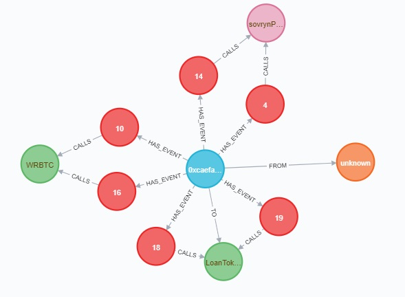
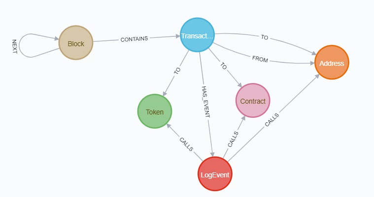

# Sovryn Knowledge Graph

## Introduction

This repo is a fork of https://github.com/except-pass/sovrynkg, with updated instructions of installation.

> A knowledge graph of the <a href='https://www.sovryn.app/'>Sovryn protocol</a> and all its transactions.

📹 [If you'd like you can follow along with a video tour](https://youtu.be/nnjaarn9IR8).


## Installation

You'll need a working docker and docker-compose.

```bash
git clone https://github.com/except-pass/sovrynkg
cd sovrynkg
docker-compose up -d
```

This starts a [neo4j database](https://neo4j.com/).  You can access it using a browser on port `7474`.  The default user name is `neo4j` and the password is `staysovryn`.  Point a browser to `http://localhost:7474` and login.


After logged in, you may check the number of match by executing
```bash
match (n) return count(n)
```

The initial count will be 0.

## Conda Environment

Install the conda environment using the `environment.yml` file

```bash
conda env create -f environment.yml
```


Then activate the conda environment
```bash
conda activate <environment name>
```

## Import Data

Initially, the database will be empty. You need to run some jupyter notebook to download the data and import into the neo4j database.

First, you will need to get an API key from https://www.covalenthq.com/. Register an account on the Covalent platform to obtain an API key for free.

Then, export the key as an enviroment variable. For example, in Ubunutu, you may execute

```bash
export COVALENT_API_KEY=YOUR_API_KEY
```

After that, start the jupyter notebook application.

```bash
jupyter notebook
```

After the notebook has been started, run all cells in `nbs/transactions.ipynb` to download transactions.


Then, run all cells in `nbs/knowledge_graph.ipynb` to import the downloaded transactions into the neo4j database.

## Tour

You can query this database using a special query langauge called Cypher.  [A cypher tutorial is beyond the scope of this writeup](https://neo4j.com/developer/cypher/), but we will go through some cool things you can do.

You can type any query directly into or into a `knowledge_graph.Query` object.  First, lets see a few blocks with available data.

```
from sovrynkg.knowledge_graph import Query
q = Query()
q.add("MATCH (b:Block) RETURN b.height as height ORDER BY height LIMIT 10")
q.data()
```


    [{'height': 2742418},
     {'height': 2742441},
     {'height': 2742445},
     {'height': 2742446},
     {'height': 2742448},
     {'height': 2742450},
     {'height': 2742451},
     {'height': 2742453},
     {'height': 2742457},
     {'height': 2742460}]


[So `2742418` is where it all began.](https://explorer.rsk.co/tx/0x4fbd96b8a2094b7233a914bbf3a253d8823c9db8469a5c30daae405535f2e8ec?__ctab=Transaction).  Lets see the transaction at that block.  Copy the following into the query bar on the browser.

```cypher
MATCH (b:Block)-[:CONTAINS]->(tx:Transaction)-[:HAS_EVENT]->(le:LogEvent)-[:CALLS]-(addy:Address) WHERE b.height=2742418 RETURN b, tx, le, addy
```

If you aren't familiar with Cypher don't worry about the syntax.  That query gets all the data about a single transaction on the given block.  You get a visual of the transaction.  You can rearrange the nodes to make them easier to see.  Selecting either a node (one of the balls) or a relationship (the connections between the nodes) lets you see any properties.

### Sovryn Protocol is created!


The first transaction on the Sovryn protocol is the creation of the contract ("transfering" ownership from the null address of all zeroes).

## So what?  I'm here for the money
Lets chase the money.  Let's analyze a high value transaction

```
q = Query()
q.add("match (tx:Transaction) return tx order by tx.value desc limit 1")
result = q.only()
result
```


    {'tx': {'gas_price': 60000000,
      'gas_offered': 172201,
      'gas_spent': 172201,
      'gas_quote': 0,
      'gas_quote_rate': 4083,
      'tx_offset': 4,
      'value_quote': 7350,
      'tx_hash': '0xcaefac99f076cd6e9e02a2b1309056eebab634f7cdf0ff28b7050dbc37c9110d',
      'value': 1800000000000000000,
      'successful': True}}


```
result['tx']['value']/10**18
```


    1.8


This transaction involved 1.8 wrapped BTC.  Let's get more details.  We use the (slightly verbose) query
```cypher
MATCH (b:Block)-[:CONTAINS]->(tx:Transaction) where tx.tx_hash="0xbef02237efff3788082b28d74e34c7c245e1e8ea6a5b1da4d40967ddd08fd5a8"
WITH tx MATCH (frm:Address)<-[:FROM]-(tx)-[:TO*0..1]-(to:Address)
WITH frm,tx,to MATCH (tx)-[:HAS_EVENT]->(le:LogEvent)-[:CALLS]-(addy:Address) 
RETURN tx, le, addy, frm, to
``` 



Looks like this transaction was a loan.  Whoever owns the `from` address `0x5d0eeaeabd5123e3d557c8a552134f24c6271a74` borrowed 1.8 WRBTC.  This address doesn't seem to match any Contract or Token documented as part of the sovryn protocol.

## Larger scale analysis

These colorful balls are all well and good, but what if you want to analyze meaningful amounts of data. We can use the knowledge graph to do larger scale analysis as well.  Let's look at a swap.  We'll limit the number of results for this example, but you could just remove the `LIMIT` clause and get all the data.

```
import plotly.express as px
from sovrynkg.swaps import get_swap_df

df = get_swap_df(skip=1000, limit=1000)
df.head()
```


<div>
<style scoped>
    .dataframe tbody tr th:only-of-type {
        vertical-align: middle;
    }

    .dataframe tbody tr th {
        vertical-align: top;
    }

    .dataframe thead th {
        text-align: right;
    }
</style>
<table border="1" class="dataframe">
  <thead>
    <tr style="text-align: right;">
      <th></th>
      <th>signed_at</th>
      <th>to_amount</th>
      <th>from_amount</th>
      <th>to_token</th>
      <th>from_token</th>
      <th>smart_token</th>
      <th>trader</th>
    </tr>
  </thead>
  <tbody>
    <tr>
      <th>0</th>
      <td>2021-06-07 20:57:18+00:00</td>
      <td>5.939477e+16</td>
      <td>1.991964e+21</td>
      <td>WRBTC</td>
      <td>USDT</td>
      <td>0x30a9b9be9aa8fd64ee43b1b6c9bd474601373d34</td>
      <td>sovrynProtocol</td>
    </tr>
    <tr>
      <th>1</th>
      <td>2021-06-07 20:49:06+00:00</td>
      <td>3.983686e+22</td>
      <td>1.192387e+18</td>
      <td>USDT</td>
      <td>WRBTC</td>
      <td>0x30a9b9be9aa8fd64ee43b1b6c9bd474601373d34</td>
      <td>sovrynProtocol</td>
    </tr>
    <tr>
      <th>2</th>
      <td>2021-06-07 20:26:27+00:00</td>
      <td>2.662208e+20</td>
      <td>7.822917e+15</td>
      <td>USDT</td>
      <td>WRBTC</td>
      <td>0x30a9b9be9aa8fd64ee43b1b6c9bd474601373d34</td>
      <td>sovrynProtocol</td>
    </tr>
    <tr>
      <th>3</th>
      <td>2021-06-07 20:25:50+00:00</td>
      <td>2.485033e+20</td>
      <td>7.302156e+15</td>
      <td>USDT</td>
      <td>WRBTC</td>
      <td>0x30a9b9be9aa8fd64ee43b1b6c9bd474601373d34</td>
      <td>sovrynProtocol</td>
    </tr>
    <tr>
      <th>4</th>
      <td>2021-06-07 20:23:55+00:00</td>
      <td>7.465110e+19</td>
      <td>2.193200e+15</td>
      <td>USDT</td>
      <td>WRBTC</td>
      <td>0x30a9b9be9aa8fd64ee43b1b6c9bd474601373d34</td>
      <td>sovrynProtocol</td>
    </tr>
  </tbody>
</table>
</div>


Great, we have the data.  Now lets try to make sense of it.  If we want to get more information about the addresses we can use a built-in tool.

```
import sovrynkg.contracts as contracts
wrbtc = contracts.BY_NAME['WRBTC']
wrbtc, wrbtc.address
```


    (<Token WRBTC:0x542…677d>, '0x542fda317318ebf1d3deaf76e0b632741a7e677d')


You can slice and dice your dataframe in powerful ways.  Let's look at the history of the `WRBTC/USDT` swaps here.

```
bt_pair = df[df.to_token=='WRBTC']
bt_pair = bt_pair[bt_pair.from_token=='USDT']

#both WRBTC and USDT have 18 decimals
bt_pair['exchange_rate'] = bt_pair.from_amount/bt_pair.to_amount
fig = px.line(bt_pair, x='signed_at', y='exchange_rate', title='WRBTC vs USDT swap on Sovryn')
fig.show()
```

## Why make this project?

In trying to learn about Sovryn I ran into two different problems.

*Its hard to get data about the Sovryn protocol.*  Before the Knowledge Graph if you wanted data on, say, the swap prices you would have to interact with the ABIs.  Now its as easy as calling a function and getting your data into python so you can start analyzing away.

*The Sovryn Protocol is complex and can be difficult to understand as a newbie.*
I wanted to understand more about the sovryn protocol.  The Sovryn documentation was a great place to start, but it wasn't enough to get me to where I felt like I could meaningful develop on the system.  There were so many moving pieces and I didn't understand how they all fit together just from the documentation.  Clicking around in the RSK block explorer I found a lot of data was given as `raw_log_topics` or lengthy address strings.  Being able to visualize how the various contracts and calls fit together has been very helpful.

## Database Schema 

The knowledge graph is made up of a few different types of nodes: `Block`, `Transaction`, `Address`, `Token`, `Contract`, and `LogEvent`.  `Token` and `Contract` are subtypes of `Address`.

`Block`s `CONTAIN` zero or more `Transaction`s.  The Transactions are where much of the action is.  Each Transaction is `from` one `Address` and may be `to` another one.  If these addresses describe known `Token`s or `Contract`s then the information for those will be filled in.

Each Transaction has one or more `LogEvents`.  Each of these events `CALLS` various Addresses (or Tokens, or Contracts).  In creating this knowledge graph, a number of ABIs were parsed so that the information in each of the `CALLS`




## Future Development

A knowledge graph is a very powerful tool for analysis.  **You can answer nearly any question that you want with a well crafted query.**  That said, there's a lot that can be built from here.  Some immediate to-dos are

- Packaging of more queries.  Not everyone wants to learn the Cypher query langauge, so having common operations packaged up as functions would be very helpful.  See the `swaps` module for an example.

- Hosting with automatic updates.  Moving from docker hub to a hosted api service would make it even easier to use and allow for up-to-the-blockheight updates.

# Stay Sovryn!
